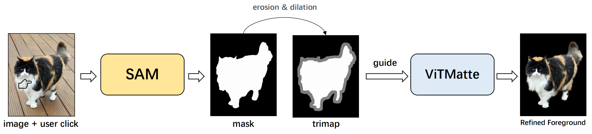

<div align="center">
<h1>Matte Anything!🐒</h1>
<h3> Matte Anything: Refine Segment Anything Masks with Image Matting </h3>

Authors: [Jingfeng Yao](https://github.com/JingfengYao), [Xinggang Wang](https://scholar.google.com/citations?user=qNCTLV0AAAAJ&hl=zh-CN)

Institute: School of EIC, HUST


</div>

#

## 📜 Introduction

[Segment Anything Model (SAM)](https://github.com/facebookresearch/segment-anything) is a powerful segmentation model that can generate segmentation masks with user interaction. However, SAM is restricted in capturing detailed object boundaries. To overcome this issue, we propose a simple framework, named Matte Anything. Specifically, we combine SAM with the image matting model [ViTMatte](https://github.com/hustvl/ViTMatte). In the framework, SAM could provide high-quality target guidance to ViTMatte, enabling it to generate fine-grained masks and foregrounds.




## 🎮 Quick Start

Try our Matte Anything with our web-ui!


### Quick Installation

Install [Segment Anything Models](https://github.com/facebookresearch/segment-anything) as following:

```
pip install git+https://github.com/facebookresearch/segment-anything.git
```

Install [ViTMatte](https://github.com/hustvl/ViTMatte) as following:
```
python -m pip install 'git+https://github.com/facebookresearch/detectron2.git'
pip install -r requirements.txt
```

Download pretrained models [SAM_vit_h](https://dl.fbaipublicfiles.com/segment_anything/sam_vit_h_4b8939.pth) and [ViTMatte_vit_b](https://drive.google.com/file/d/1d97oKuITCeWgai2Tf3iNilt6rMSSYzkW/view?usp=sharing) and put it in ``./pretrained_models``

### Run our web-ui!
```
python matte_anything.py
```

## 📋 Todo List

- [ ] add images examples for quick start
- [ ] adjustable trimap generation
- [ ] test matte anything on public datasets
- [ ] support video matting
- [ ] arxiv tech report


## 🤝Acknowledgement

Our repo is built upon [Segment Anything](https://github.com/facebookresearch/segment-anything) and [ViTMatte](https://github.com/hustvl/ViTMatte). Thanks to their work.