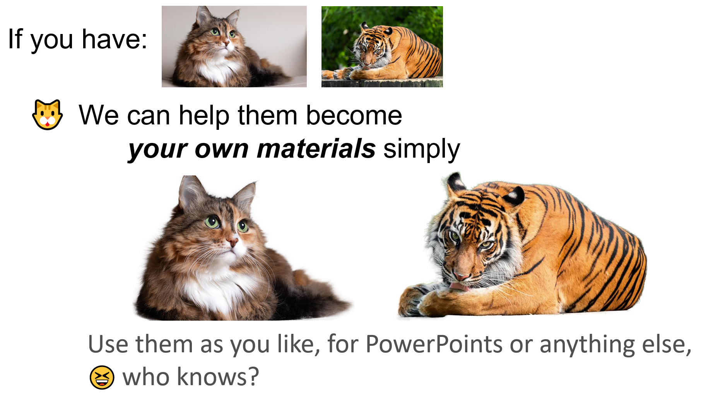
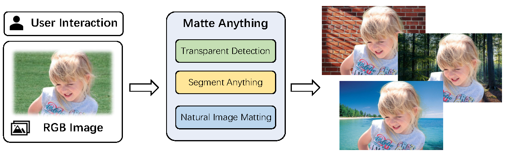
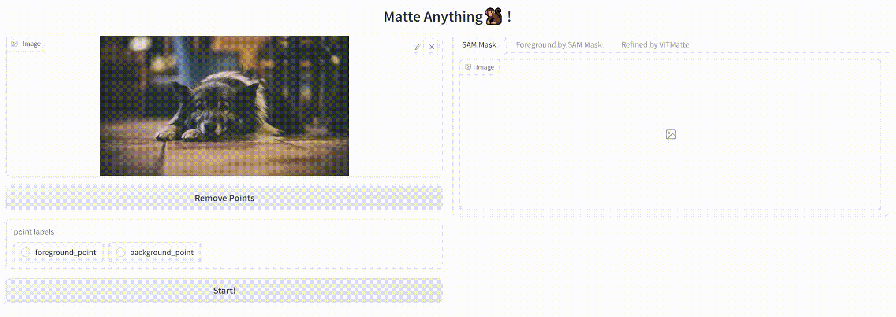
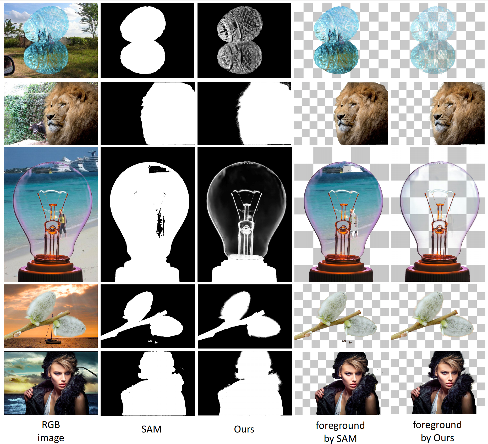
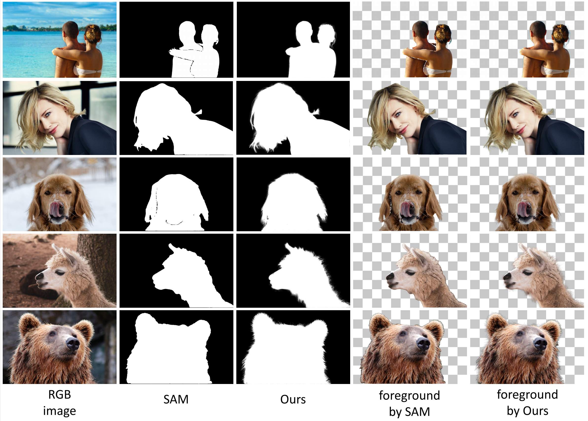

<div align="center">
<h1>Matte Anything!🐒</h1>
<h3> Interactive Natural Image Matting with Segment Anything Models </h3>

Authors: [Jingfeng Yao](https://github.com/JingfengYao), [Xinggang Wang](https://scholar.google.com/citations?user=qNCTLV0AAAAJ&hl=zh-CN)<sup>:email:</sup>, [Lang Ye](https://github.com/YeL6), [Wenyu Liu](http://eic.hust.edu.cn/professor/liuwenyu/)

Institute: School of EIC, HUST

(<sup>:email:</sup>) corresponding author

[](https://arxiv.org/abs/2306.04121)
[](https://github.com/hustvl/Matte-Anything/assets/74295796/dfe051c2-b5d1-442d-9eff-cd1fcfd1f51b)
[](LICENSE)
[](https://github.com/hustvl)

</div>


#

## 📢 News

* **`2024/05/04`** Matte Anything has been accepted by the Journal of Image and Vision Computing!
* **`2024/01/02`** Now you can get alpha materials with MatAny! Check it now!
* **`2023/07/01`** We release a new version that enables text input and transparency correction!
* **`2023/06/08`** We release arxiv tech report! 
* **`2023/06/08`** We release source codes of Matte Anything!

The program is still in progress. You can try the early version first! Thanks for your attention. If you like Matte Anything, you may also like its previous foundation work [ViTMatte](https://github.com/hustvl/ViTMatte).

#

## 🔥 Transparent Materials of Yourself !

MatAny could get matting results as *RGBA images*. It will be saved into ```your_demos/your_demo.png```. You can specify the saving name of it in our UI. We hope MatAny could help.

<p align="center">

</p>

## 📜 Introduction

We propose Matte Anything (MatAny), an interactive natural image matting model. It could produce high-quality alpha-matte with various simple hints. The key insight of MatAny is to generate pseudo trimap automatically with contour and transparency prediction. We leverage task-specific vision models to enhance the performance of natural image matting.




## 🌞 Features
* Matte Anything with Simple Interaction
* High Quality Matting Results
* Ability to Process Transparent Object


## 🎮 Quick Start

Try our Matte Anything with our web-ui!



### Quick Installation

Install [Segment Anything Models](https://github.com/facebookresearch/segment-anything) as following:

```
pip install git+https://github.com/facebookresearch/segment-anything.git
```

Install [ViTMatte](https://github.com/hustvl/ViTMatte) as following:
```
python -m pip install 'git+https://github.com/facebookresearch/detectron2.git'
pip install -r requirements.txt
```

Install [GroundingDINO](https://github.com/IDEA-Research/GroundingDINO) as following:
```
cd Matte-Anything
git clone https://github.com/IDEA-Research/GroundingDINO.git
cd GroundingDINO
pip install -e .
```

Download pretrained models [SAM_vit_h](https://dl.fbaipublicfiles.com/segment_anything/sam_vit_h_4b8939.pth), [ViTMatte_vit_b](https://drive.google.com/file/d/1d97oKuITCeWgai2Tf3iNilt6rMSSYzkW/view?usp=sharing), and [GroundingDINO-T](https://github.com/IDEA-Research/GroundingDINO/releases/download/v0.1.0-alpha/groundingdino_swint_ogc.pth). Put them in ``./pretrained``

### Run our web-ui!
```
python matte_anything.py
```

### How to use
1. Upload the image and click on it (default: ``foreground point``).
2. Click ``Start!``.
3. Modify ``erode_kernel_size`` and ``dilate_kernel_size`` for a better trimap (optional).

## 🎬 Demo


https://github.com/hustvl/Matte-Anything/assets/74295796/dfe051c2-b5d1-442d-9eff-cd1fcfd1f51b


Visualization of SAM and MatAny on real-world data from [AM-2K](https://github.com/JizhiziLi/GFM) and [P3M-500](https://github.com/JizhiziLi/P3M) .

 Visualization of SAM and MatAny on [Composition-1k](https://arxiv.org/pdf/1703.03872v3.pdf)



## 📋 Todo List

- [x] adjustable trimap generation
- [x] arxiv tech report
- [x] support user transparency correction
- [x] support text input
- [ ] add example data
- [ ] finetune ViTMatte for better performance


## 🤝Acknowledgement

Our repo is built upon [Segment Anything](https://github.com/facebookresearch/segment-anything), [GroundingDINO](https://github.com/IDEA-Research/GroundingDINO), and [ViTMatte](https://github.com/hustvl/ViTMatte). Thanks to their work.

## Citation
```
@article{yao2024matte,
  title={Matte anything: Interactive natural image matting with segment anything model},
  author={Yao, Jingfeng and Wang, Xinggang and Ye, Lang and Liu, Wenyu},
  journal={Image and Vision Computing},
  pages={105067},
  year={2024},
  publisher={Elsevier}
}
```
